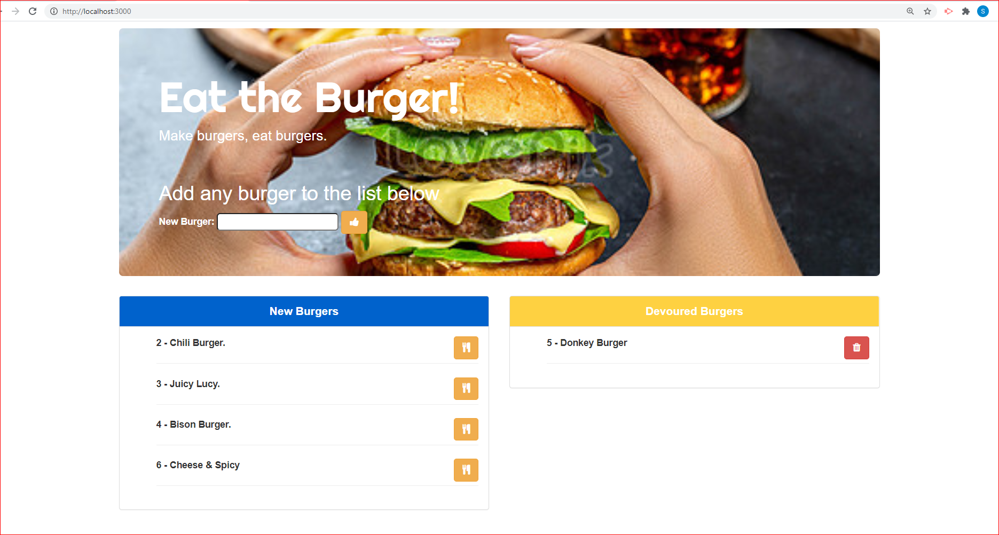

# node-express-handlebars
Eat a Burger!

# Description
This application demonstrates a simple full stack application with a front end implemented with HTML/CSS and the backend implemented with Node.js and Express. 

# Languages & Technologies used
MySQL, Node, Express, Handlebars, ORM

# Heroku deployment Url 

https://git.heroku.com/mynodeexpresshandlebars.git

# aplication screenshot 

